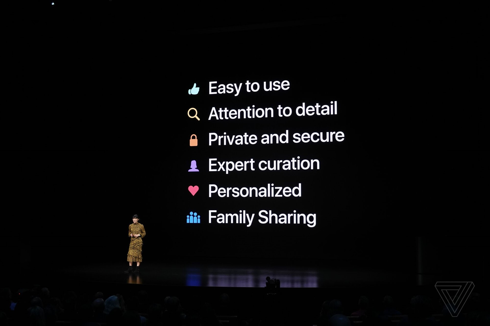

Apple's approach to human-computer interaction (HCI) and user experience (UX) design in general has always been different than its competitors. Paradoxically, the approach they use to design their software has also influenced their competitors. Their well-cited and studied [human interface guidelines](https://developer.apple.com/design/human-interface-guidelines/ "Apple Developer - Apple Human Interface Guidelines") continue to serve as inspiration for new and old UX practitioners alike.

Based on their March event and their developers conference held last week, Apple is transforming their design identity as they focus on the services economy, and the software they develop to deliver those services. In 2007,  Apple [dropped "Computer" from their corporate name](https://www.engadget.com/2007/01/09/apple-drops-computer-from-name/ "Engadget.com - Apple Drops Computer From Name") to better establish their direction as a company focused on software and not traditional computer hardware. Or, put another way, they changed their name to reflect their investment in human interaction.

At their recent media event in March promoting their new services (TV+ and News+, among others), this slide captured my attention:

 

<small className="italic text-heading-text dark:text-dark-heading-text">Source: [Apple Special Event presented on March 25, 2019](https://www.apple.com/apple-events/march-2019/ "Apple Special Event Keynote March 25, 2019")</small>

This slide forms an experience design ethos and establishes a set of rules focused on the _human experience_ of their software. Given that this slide was displayed _multiple_ times during their March event, it demonstrates _how_ important the user experience is to Apple, and how they think about the user when developing their products (and admittedly, they don't always get it right). 

This has got me thinking about how I approach UX design, and what type of ethos I might apply to my own work. As a UX practitioner, it's important I always consider the _human_ element (which is a given). A common maxim used by UX practitioners is "you are not the user". It's a good starting point, but I wonder if it goes far enough? 

An ethos such as the one Apple has developed can help UX practitioners build consistent experiences. Apple's new ethos has an inherent focus on delivering consistent experiences. Their application of UX design appears to center itself around facilitating human _connection_, and I think that's pretty great.