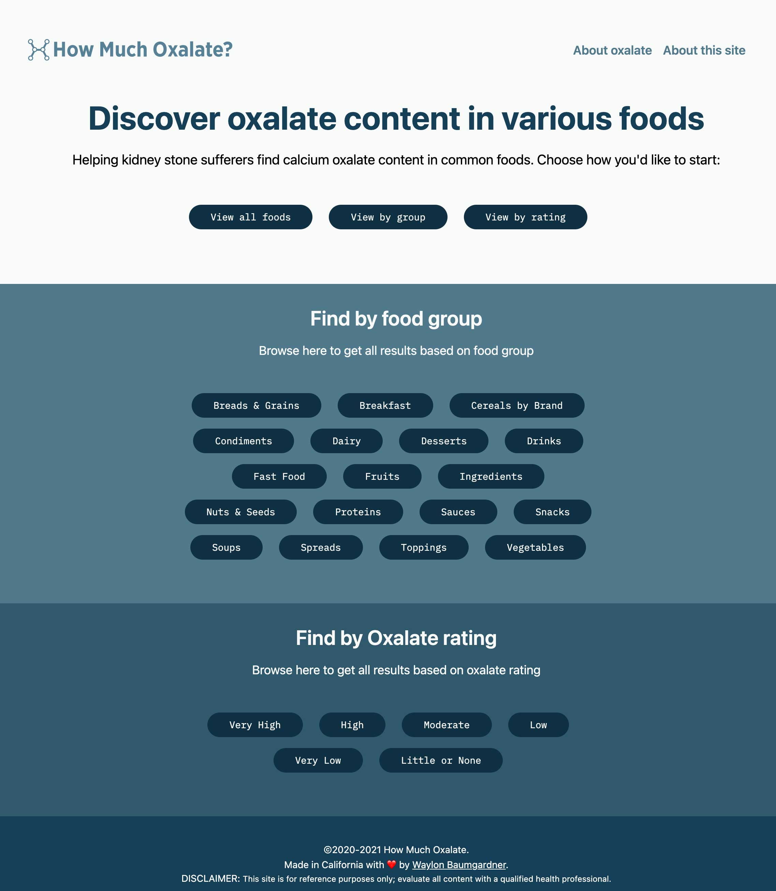

import * as React from 'react';
import { Link } from 'gatsby';

Back in September I wrote about <Link to={`/writing/side-projects`} title="Side projects">side projects</Link>. Since then, I've made regular progress on one of those side projects, and now reached a point where I can launch it to the world. Let me introduce you to *How Much Oxalate?*.

_How Much Oxalate?_ was born out of the desire to build something that *I* would use myself. I designed and developed this site from scratch, spending numerous nights and weekends over the past five months agonizing over pixel decisions and development methodologies.

## Some background

I wanted to share a bit more context about what exactly _How Much Oxalate?_ is. As I've written about <Link to={`/writing/a-journey-to-better-health`} title="A Journey to Better Health">previously</Link>, I suffer from calcium oxalate kidney stones. One of the things I need to do to help reduce my risk of forming new stones is keep an eye on the foods and drinks I ingest that contain a substance called oxalate (oxalate is what you get when oxalic acid and minerals combine). When calcium (a mineral) and oxalic acid combine in the kidney, they form crystals (stones).

_How Much Oxalate?_ is a site that contains research Harvard University has made freely available. That research resulted in testing over 500 different kinds of foods and drinks to evaluate their oxalate content (measured in milligrams). In effect, the *higher* the oxalate content, the *greater* the chance of developing stones. 

## Defining the strategy

I defined an overarching strategy to help guide my work on this side project. Even though this was a side project, it was important for me to define a scope of work and ensure I established a clear path to completion. For this site, my strategy was pretty straightforward: develop something *useful* for calcium oxalate kidney stone sufferers.

From a tactical standpoint, I needed to figure out how users would consume the data in a way that was useful for them.After several iterations, I narrowed down the design to three specific paths to consume the data:

* *All foods* &ndash; a table listing of the data that is filterable; essentially a raw data dump
* *Foods by group* &ndash; a page listing with cards of all foods in specific food groups, automatically sorted by highest to lowest oxalate
* *Foods by rating* &ndash; a page listing with cards of all foods and drinks that match specific ratings 

Narrowing it down to three distinct paths helped ensure I had a solid foundation in place. Also, it allowed for users to quickly find the oxalate content of common foods and drinks to make informed decisions about the foods they consume. 

## Closing thoughts

As I mentioned earlier, I wanted to build something useful, but also useful to me. Now if I'm shopping for groceries or evaluating a new recipe, I can check the oxalate content of those ingredients to ensure I'm avoiding foods that are too high in oxalate.

It feels really good to get this launched! I'm working on a new portfolio entry for this project to showcase the UX/UI/development work I did, and I'll update this post with that link once it's up.

Until then, check out [How Much Oxalate?](https://howmuchoxalate.com "How Much Oxalate? website") for yourself.

<small>P.S. &mdash; If you're interested in taking a peek at the source code, go ahead and <a href="https://github.com/waylonrobert/how-much-oxalate" title="How Much Oxalate GitHub repository">view the GitHub repository</a> (don't mind my messy TODOs though 😉).</small>

